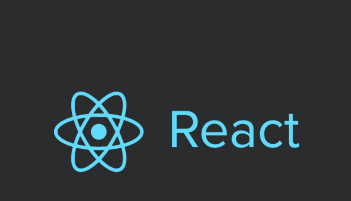

# React Filtered List



## Information

Getting started with React is as simple as start building a new React single page application. This repository is based on the [Learning React.js: Getting Started and Concepts](https://scotch.io/tutorials/learning-react-getting-started-and-concepts) from [scotch.io](https://scotch.io/) tutorials.

## Run

```
cd app
npm install
npm start
```
